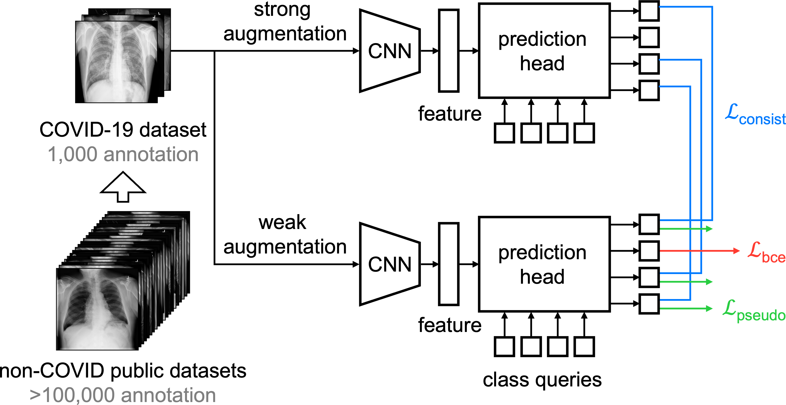

# Label-Assemble

We introduce a new initiative, "label-assemble", that assembles large-scale datasets from available data resources, instead of piling up data and labels from scratch for every task, overcoming the deficiency of the current annotation paradigms. We discover that learning from the classes in "negative examples" can better delimit the decision boundary of the class of interest. This discovery is the foundation of the "data, assemble" initiative, underlining the necessity of assembling multiple datasets with diverse (yet partial) labels. It also sheds new light on the computer-aided diagnosis of rare diseases and emerging pandemics, wherein "positive examples" are hard to collect, yet "negative examples" are relatively easier to assemble.

<p align="center"></p>

## Paper
This repository will provide the official implementation of the following paper:

<b>Assembling Existing Labels from Public Datasets to Diagnose Novel Diseases: COVID-19 in Late 2019</b> <br/>
Zengle Zhu<sup>1</sup>, [Mintong Kang](https://scholar.google.com/citations?hl=en&user=oHXw2SAAAAAJ)<sup>2</sup>, [Alan L. Yuille](https://www.cs.jhu.edu/~ayuille/)<sup>3</sup>, and [Zongwei Zhou](https://www.zongweiz.com/)<sup>3,*</sup> <br/>
<sup>1 </sup>Tongji University,   <sup>2 </sup>Zhejiang University,   <sup>3 </sup>Johns Hopkins University <br/>
Medical Imaging Meets NeurIPS, 2022 <br/>
[paper](https://www.cs.jhu.edu/~alanlab/Pubs22/zhu2022assembling.pdf) | [code](https://github.com/MrGiovanni/DataAssemble) | [slides]()

<b>Label-Assemble: Leveraging Multiple Datasets with Partial Labels</b> <br/>
[Mintong Kang](https://scholar.google.com/citations?hl=en&user=oHXw2SAAAAAJ)<sup>1</sup>, [Yongyi Lu](https://scholar.google.com/citations?user=rIJ99V4AAAAJ&hl=en)<sup>2</sup>, [Alan L. Yuille](https://www.cs.jhu.edu/~ayuille/)<sup>2</sup>, and [Zongwei Zhou](https://www.zongweiz.com/)<sup>2,*</sup> <br/>
<sup>1 </sup>Zhejiang University,   <sup>2 </sup>Johns Hopkins University <br/>
arXiv preprint arXiv:2109.12265, 2021 <br/>
[paper](https://arxiv.org/pdf/2109.12265.pdf) | [code](https://github.com/MrGiovanni/DataAssemble) | [slides](https://d5b3ebbb-7f8d-4011-9114-d87f4a930447.filesusr.com/ugd/deaea1_d6c4a2b816f442209fbce205fc795b5a.pdf)


## Dependencies

+ Linux
+ Python 3.6+
+ pytorch 1.2+


## Usage of Label-Assemble

### 1. Clone the repository
```bash
$ git clone https://github.com/MrGiovanni/LabelAssemble.git
```

### 2. Prepare the datasets
The datasets we mainly used are COVIDx and ChestX_ray14.
So you can download the two datasets from [COVIDx-CXR2](https://www.kaggle.com/datasets/andyczhao/covidx-cxr2) and [NIH](https://nihcc.app.box.com/v/ChestXray-NIHCC). 


### 3. Train the model
When you have the dataset ready, you can train the model.
```bash
$ bash run.sh
```
Then you can reproduce our experiments.
Note that you should change the parameters.

## Train models from your own data

### 1. Implement Dataset Config
In `config.py`, there is a `dict` named `CustomConfig`. 
```python
CustomConfig = dict(
    train_img_path = None,
    val_img_path = None,
    test_img_path = None,
    train_file_path = None,
    val_file_path = None,
    test_file_path = None,
    class_num = None,
    class_filter = None,
    using_num = None
)
```
What you need to do is implement these codes.
- train_img_path: the directory of train set.
- val_img_path: the directory of validation set.
- test_img_path: the directory of test set.
- train_file_path: the path of train file.
- val_file_path: the path of validation file.
- test_file_path: the path of test file.
- class_filter: classes that you need.
- using_num: the total numbel images that you want to use.


### 2. Implement Dataset
In `datasets.py`, there is a `class` named `CustomDataset`. It is subclass of `BaseDataset`. What you need to do is to implement two functions: `parse_line` and `filter`. The input of `parse_line` is one line of the train/val/test file, and the output is image label and image path. 
And the `filter` is to filter classes that you do not want to use.
Remeber that these two function must be implemented.

### 3. 